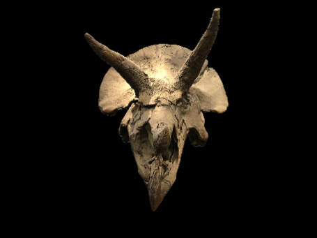

# Research-on-Object-Level-Reconstruction-Based-on-3D-Gaussian-Models


This repository presents an object-level 3D reconstruction framework based on
3D Gaussian Splatting, designed to accurately model individual objects from
multi-view RGB-D observations.

The proposed method focuses on probabilistic object modeling and produces
clean, compact Gaussian representations suitable for downstream analysis and
rendering.

---

## 🔍 Overview

We perform object-level reconstruction by optimizing a set of 3D Gaussians
constrained by multi-view image observations.
Each Gaussian is associated with an object membership probability, enabling
robust separation between foreground objects and background regions.

The overall reconstruction pipeline is illustrated below.


---

## 🎥 Visual Results

### Reconstruction Results




<!--  -->

### Video Demo
[](https://youtu.be/XXXXXXX)

---

## 📂 Code Availability

The code will be released after paper acceptance.

---

## 📄 Citation

If you find this work useful, please consider citing:

```bibtex
@article{xxx2025objectgs,
  title={Object-Level 3D Gaussian Reconstruction with Probabilistic Modeling},
  author={Zhang, Kid and others},
  journal={Under Review},
  year={2025}
}
